# Active Directory：機能レベルを2003から2008 R2へ引き上げ、SYSVOLをFRSからDFSRへ移行する

## 概要

前回の記事では、停止したDC2008の残存情報と不要なOLD-SITEを削除した。  
本記事では、機能レベルをWindows Server 2003から2008 R2へ引き上げ、Windows Server 2022への移行準備として、SYSVOLの複製方式をFRSからDFSRへ移行する。最後に、両DCへの反映とSYSVOLの複製状態を確認する。

## 機能レベルとSYSVOL複製方式の変更イメージ
DC2012R2-01／02の構成は変更せず、ドメインおよびフォレスト機能レベルをWindows Server 2003から2008 R2へ引き上げる。続いて、SYSVOLの複製方式をFRSからDFSRへ移行する。

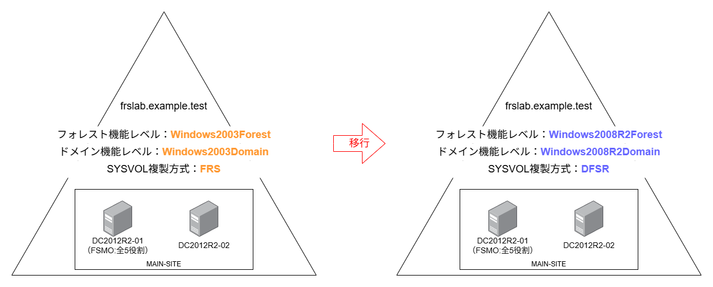

## Step 0. 作業前の状態確認

機能レベルの引き上げとDFSR移行を開始する前に、現在の機能レベルとSYSVOL複製方式を確認する。

| 確認項目 | コマンド・確認方法 | 期待する結果 |
| --- | --- | --- |
| ドメイン機能レベル | Get-ADDomain | Select-Object DomainMode | Windows2003Domain |
| フォレスト機能レベル | Get-ADForest | Select-Object ForestMode | Windows2003Forest |
| SYSVOL 複製方式確認 | ［サーバーマネージャー］→［ツール］→［ADSIエディター］でSYSVOL関連オブジェクトを確認 | FRSを使用している |
<br>

**ADSIエディターの接続設定について**  
初回起動時は、既定の名前付けコンテキストへの接続設定が必要となる。この接続設定は、ADSI エディターに表示する接続先を追加するだけであり、Active Directory のオブジェクトには影響しない。確認後に接続設定を削除すれば、初回起動時の状態に戻すことができる。  
ただし、接続先の配下に表示されるオブジェクトを削除した場合は、Active Directory 上の実データも削除されるため注意する。

### SYSVOL複製方式の確認

まずは現状のSYSVOL複製方式を確認する。
結論から言うと、画像のようにCN=File Replication Service配下にCN=Domain System Volume (SYSVOL share)が存在する場合は、SYSVOLの複製にFRSが使用されている。  
一方、CN=DFSR-GlobalSettings配下にCN=Domain System Volumeが存在する場合は、DFSRが構成されている。  
FRS側とDFSR側の両方に関連オブジェクトが存在する場合は、DFSRへの移行途中である可能性がある。

参考:[https://jpwinsup.github.io/blog/2023/03/27/ActiveDirectory/DFSR/migration-from-FRS-to-DFSR/](https://jpwinsup.github.io/blog/2023/03/27/ActiveDirectory/DFSR/migration-from-FRS-to-DFSR/)

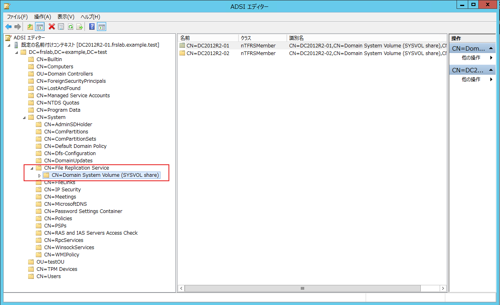

### SYSVOL／NETLOGON共有を確認

DC2012R2-01で以下のコマンドを実行し、両DCの共有フォルダーを確認する。両方の実行結果にSYSVOLとNETLOGONが表示されることを確認する。

```powershell
net view \\DC2012R2-01
net view \\DC2012R2-02

実行結果:
共有名    タイプ  使用  コメント

-------------------------------------------------------------------------------
NETLOGON  Disk          Logon server share
SYSVOL    Disk          Logon server share
コマンドは正常に終了しました。

```


### 既存GPOのSYSVOLファイルを確認

グループポリシーの管理画面で、事前に作成した検証用GPOの一意のID（GUID）を確認する。エクスプローラーから、両DCのSYSVOLにある検証用GPOのフォルダーを開く。

```powershell
\\DC2012R2-01\SYSVOL\frslab.example.test\Policies\{GPOのGUID} 
\\DC2012R2-02\SYSVOL\frslab.example.test\Policies\{GPOのGUID}
```

両方に同じGPOフォルダーと関連ファイルが存在し、GPT.INIに記載されたVersionの値が一致していることを確認する。

## Step 1.ドメイン機能レベルの引き上げ

機能レベルは、ドメイン、フォレストの順に引き上げる。フォレスト機能レベルの引き上げには、すべてのドメインが変更先と同等以上の機能レベルである必要があるため、逆の順序では実施できない。  
参考：[https://learn.microsoft.com/en-us/windows-server/identity/ad-ds/plan/raise-domain-forest-functional-levels?utm_source=chatgpt.com&tabs=desktop](https://learn.microsoft.com/en-us/windows-server/identity/ad-ds/plan/raise-domain-forest-functional-levels?utm_source=chatgpt.com&tabs=desktop)

<br>
以降の変更操作は、全FSMO役割を保持しているDC2012R2-01で実行する。全FSMO役割を保持しているドメコンがなんなのか確認するにはnetdom query fsmoコマンドの実行結果を確認すること

```powershell
実行結果:
スキーマ マスター                DC2012R2-01.frslab.example.test
ドメイン名前付けマスター        DC2012R2-01.frslab.example.test
PDC                         DC2012R2-01.frslab.example.test
RID プール マネージャー        DC2012R2-01.frslab.example.test
インフラストラクチャ マスター    DC2012R2-01.frslab.example.test
コマンドは正しく完了しました。
```

<br>
［サーバーマネージャー］→［ツール］→［Active Directory ドメインと信頼関係］を選択。
<ドメイン名>で右クリックし、[ドメイン]の機能レベルの昇格を選択する

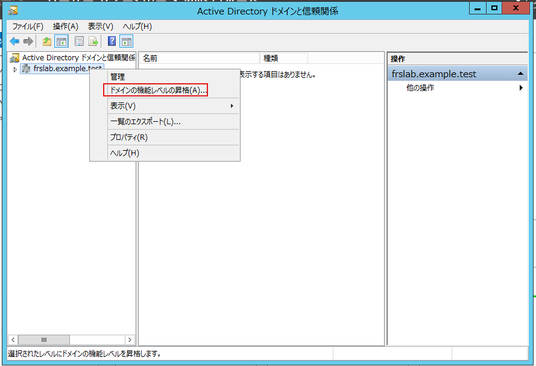

<br>
「利用可能なドメインの機能レベルを選択してください」で、「Windows Server 2008」以上を選択し、「上げる」を選択（図では「Windows Server 2008 R2」を選択）

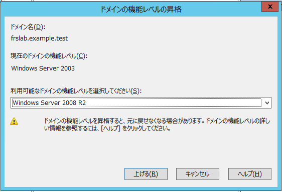

<br>
[OK]を選択

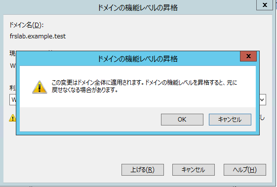

<br>
ドメイン機能レベルが昇格したことを確認する（本環境ではOK押した瞬間に完了）
「OK」を選択する

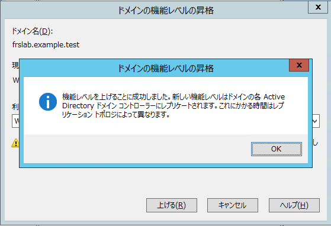

<br>
DC2012R2-01とDC2012R2-02で以下のコマンドを打ち、それぞれ期待値であることを確認する

| 確認項目 | コマンド・確認方法 | 期待する結果 |
| --- | --- | --- |
| ドメイン機能レベル | Get-ADDomain | Select-Object DomainMode | Windows2008R2Domain |
| フォレスト機能レベル | Get-ADForest | Select-Object ForestMode | Windows2003Forest |

## Step 2.フォレスト機能レベルの引き上げ

ドメイン機能の昇格が終わったら次にフォレスト機能レベルを上げる。
[Active Directory ドメインと信頼関係[DC名]]を右クリックし、「フォレスト機能レベルの昇格」を選択する

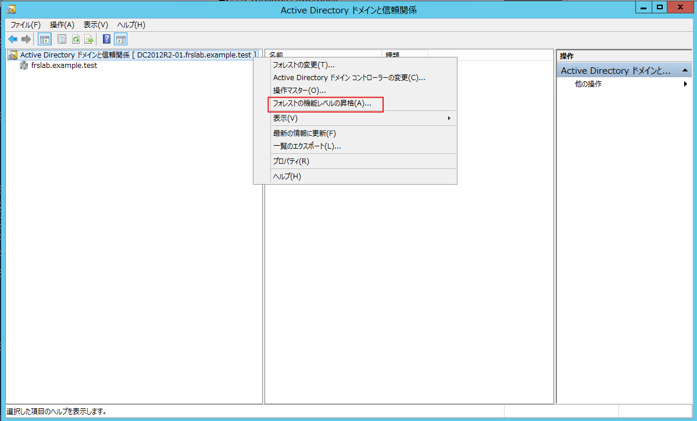

<br>
「利用可能なフォレストの機能レベルを選択してください」で、「Windows Server 2008」以上を選択し、「上げる」を選択（図では「Windows Server 2008 R2」を選択）

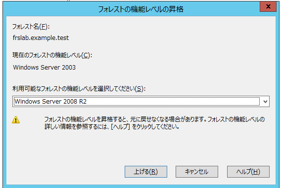

<br>
[OK]を選択

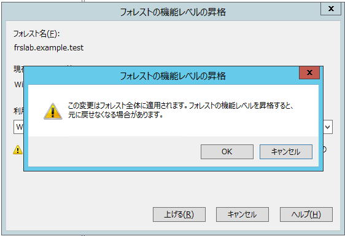

<br>
フォレスト機能レベルが昇格したことを確認する（本環境ではOK押した瞬間に完了）
「OK」を選択する

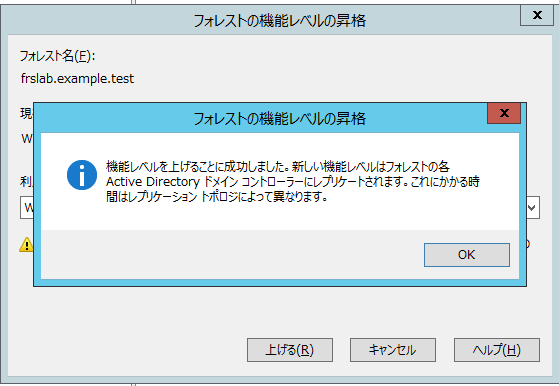

<br>
DC2012R2-01とDC2012R2-02で以下のコマンドを打ち、それぞれ期待値であることを確認する

| 確認項目 | コマンド・確認方法 | 期待する結果 |
| --- | --- | --- |
| ドメイン機能レベル | Get-ADDomain | Select-Object DomainMode | Windows2008R2Domain |
| フォレスト機能レベル | Get-ADForest | Select-Object ForestMode | Windows2008R2Forest |

## Step 3. FRSからDFSRへの移行

はじめにDFSRへの移行の流れを簡単に述べる。以下はMicrosoftの資料を基に、筆者なりに移行プロセスを整理したものである。詳細は本リンクを参照のこと。  
参考：[https://jpwinsup.github.io/blog/2023/03/27/ActiveDirectory/DFSR/migration-from-FRS-to-DFSR/](https://jpwinsup.github.io/blog/2023/03/27/ActiveDirectory/DFSR/migration-from-FRS-to-DFSR/)

まず移行にはdfsrmig.exeを使用する。移行状態には、ドメイン全体の目標を示すGlobal Migration Stateと、各DCの現在地を示すLocal Migration Stateがある。DFSRへの移行は、図の赤丸で示したGlobal Migration Stateを随時指定していくことで行う。

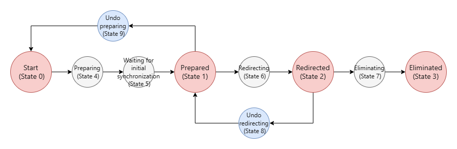

最初に/CreateGlobalObjectsでDFSR用のADオブジェクトを作成する（これがState 0の赤丸を作ることと同義）。その後、Stateを1、2、3の順に進め、各段階で/GetMigrationStateを実行する。すべてのDCが移行を完了したことを確認してから次の状態へ進む。State 3の状態になればDFSRへ移行は完了。  
なお、一度State 3（一番右の赤丸）へ移行してしまうとFRSへ戻せなくなることは認識しておくこと。


### イベントログ正常性確認
DFSR移行前に「ドメコンが正常に動作しているか」「イベントログ等でエラーが発生していないか」など問題がないか確認する。
DC2012R2-01／02のそれぞれでeventvwr.mscを開き、直近24時間の警告・エラーを確認（System、Directory Service、File Replication Service、DNS Serverあたり）

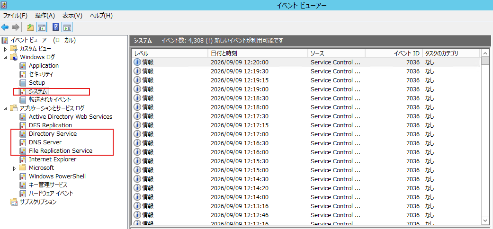

### DCDIAGを両DCに実行

DC2012R2-01から以下を実行して、失敗した項目がないかを確認する

```powershell
dcdiag /s:DC2012R2-01 /v
dcdiag /s:DC2012R2-02 /v
```

### AD複製を再確認

DFSR移行直前に再度確認

```powershell
repadmin /showrepl DC2012R2-01
repadmin /showrepl DC2012R2-02
repadmin /replsummary
```

### FRSによるSYSVOL複製を確認

DC2012R2-01のC:\Windows\SYSVOL\domain配下にテスト用ファイルを作って、それがDC2012R2-02にも反映されることを確認

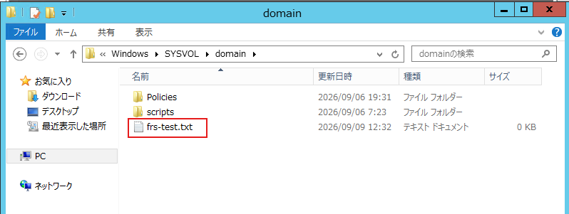

### DFSRへ移行

まずは現状初期化されていないことを確認する。Powershellで以下を実行する

```powershell
dfsrmig.exe /GetGlobalState

実行結果：
DFSR 移行がまだ初期化されていません。移行を開始するには、グローバル
状態を目的の値に設定してください。
```

<br>
dfsrmig.exe /CreateGlobalObjectsを実行しDFSR へ移行処理を開始

```powershell
dfsrmig.exe /CreateGlobalObjects

実行結果：
DFSR の現在のグローバル状態: '開始'
成功しました。
```

<br>
上記実行後、DC2012R2-01/DC2012R2-02で以下を実行し、同じ結果になることを確認する

```powershell
dfsrmig.exe /GetGlobalState

実行結果：
DFSR の現在のグローバル状態: '開始'
成功しました。
```

```powershell
dfsrmig.exe /GetMigrationState

実行結果：
すべてのドメイン コントローラーがグローバル状態 ('開始') に移行しました。
移行状態が、すべてのドメイン コントローラー上で整合性のとれた状態になりました。
成功しました。
```

<br>
ADSIエディタでCN=DFSR-GlobalSettingsが作成されていることを確認する

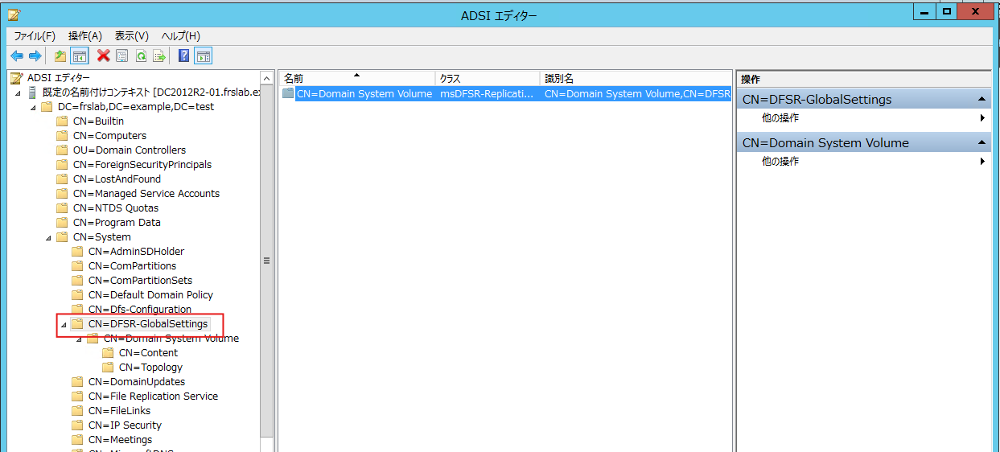

<br>
dfsrmig /SetGlobalState 1 を実行しState 1へ移行

```powershell
dfsrmig.exe /SetGlobalState 1

実行結果：
DFSR の現在のグローバル状態: '開始'
新しい DFSR のグローバル状態: '準備完了'

'準備完了' 状態に移行します。DFSR サービスによって
SYSVOL が SYSVOL_DFSR フォルダーにコピーされ
ます。

いずれかのドメイン コントローラーで移行を開始できない場合は、手動ポーリングを試行してください。
または、/CreateGlobalObjects オプションを指定して実行してください。
移行は 15 分から 1 時間までの任意の時点で開始されます。
成功しました。
```

<br>
上記実行後、DC2012R2-01/DC2012R2-02で以下を実行し、同じ結果になることを確認する

```powershell
dfsrmig.exe /GetGlobalState

実行結果：
DFSR の現在のグローバル状態: '準備完了'
成功しました。
```

<br>
dfsrmig.exe /GetMigrationStateは筆者環境では15分ほど待って完了した。

```powershell
dfsrmig.exe /GetMigrationState

実行結果（成功時）：
すべてのドメイン コントローラーがグローバル状態 ('準備完了') に移行しました。
移行状態が、すべてのドメイン コントローラー上で整合性のとれた状態になりました。
成功しました。

実行結果（完了していないとき）：
次のドメイン コントローラーは、グローバル状態 ('準備完了') になっていません:

ドメイン コントローラー (ローカル移行状態) - DC の種類
===================================================

DC2012R2-02 ('初期同期の待機中') - Writable DC

移行状態が、すべてのドメイン コントローラー上で整合性のとれた状態にまだなっていません。
Active Directory ドメイン サービスの待ち時間が原因で状態の情報が最新になっていない可能性があります。
```

<br>
ADSIエディタでCN=Topologyの中に各DCのコンテナが作成されていることを確認する

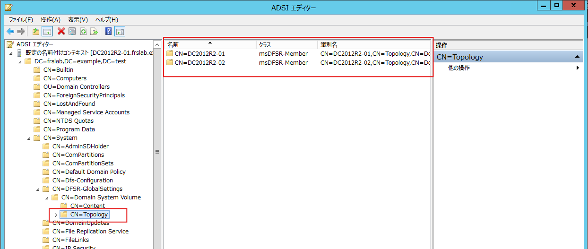

<br>
SYSVOLと同じディレクトリに SYSVOL_DFSR が作成されていることを確認する ( 既定では C:\WINDOWS\SYSVOL_DFSR )

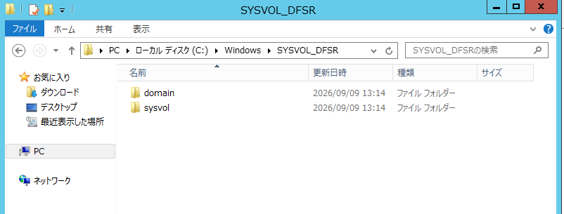

<br>
dfsrmig /SetGlobalState 2を実行しState 2へ移行

```powershell
dfsrmig.exe /SetGlobalState 2

実行結果：
DFSR の現在のグローバル状態: '準備完了'
新しい DFSR のグローバル状態: 'リダイレクト済み'

'リダイレクト済み' 状態に移行します。SYSVOL 共有が、
DFSR を使用してレプリケートされた SYSVOL_DFSR
フォルダーに変更されます。

成功しました。
```

<br>
上記実行後、DC2012R2-01/DC2012R2-02で以下を実行し、同じ結果になることを確認する

```powershell
dfsrmig.exe /GetGlobalState

実行結果：
DFSR の現在のグローバル状態: 'リダイレクト済み'
成功しました。
```

```powershell
dfsrmig.exe /GetMigrationState

実行結果：
すべてのドメイン コントローラーがグローバル状態 ('リダイレクト済み') に移行しました。
移行状態が、すべてのドメイン コントローラー上で整合性のとれた状態になりました。
成功しました。
```

<br>
net share コマンド実行結果で、[リソース] の列がSYSVOLではなくSYSVOL_DFSR に変更されていることを確認する

```powershell
net share

共有名       リソース                            注釈

-------------------------------------------------------------------------------
C$           C:\                             Default share
IPC$                                         Remote IPC
ADMIN$       C:\Windows                      Remote Admin
NETLOGON     C:\Windows\SYSVOL_DFSR\sysvol\frslab.example.test\SCRIPTS
                                             Logon server share
SYSVOL       C:\Windows\SYSVOL_DFSR\sysvol   Logon server share
コマンドは正常に終了しました。
```

<br>
dfsrmig /SetGlobalState 3 を実行しState 3へ移行

```powershell
dfsrmig.exe /SetGlobalState 3

実行結果：
DFSR の現在のグローバル状態: 'リダイレクト済み'
新しい DFSR のグローバル状態: '削除済み'

'削除済み' 状態に移行します。このステップを元に戻すことは
できません。

いずれかの読み取り専用ドメイン コントローラーが長時間にわたって '削除済み' 状態
になっている場合は、/DeleteRoNtfrsMember オプションを指定して実行してください。
成功しました。
```

<br>
上記実行後、DC2012R2-01/DC2012R2-02で以下を実行し、同じ結果になることを確認する

```powershell
dfsrmig.exe /GetGlobalState

実行結果：
DFSR の現在のグローバル状態: '削除済み'
成功しました。
```

<br>
dfsrmig.exe /GetMigrationStateは筆者環境では5分ほど待って完了した。

```powershell
dfsrmig.exe /GetMigrationState

実行結果：
すべてのドメイン コントローラーがグローバル状態 ('削除済み') に移行しました。
移行状態が、すべてのドメイン コントローラー上で整合性のとれた状態になりました。
成功しました。
```

<br>
ちなみに、完了していない時の実行結果は以下のようになる

```powershell
実行結果（完了していないとき）：
次のドメイン コントローラーは、グローバル状態 ('削除済み') になっていません:

ドメイン コントローラー (ローカル移行状態) - DC の種類
===================================================

DC2012R2-02 ('リダイレクト済み') - Writable DC
DC2012R2-01 ('削除中') - Primary DC

移行状態が、すべてのドメイン コントローラー上で整合性のとれた状態にまだなっていません。
Active Directory ドメイン サービスの待ち時間が原因で状態の情報が最新になっていない可能性があります。
```

<br>
SYSVOLフォルダが削除されていることを確認する

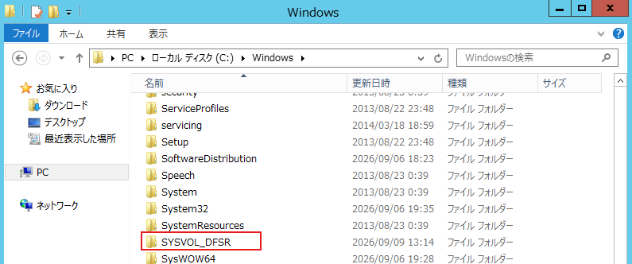

<br>
ADSIエディタでCN=Domain System Volume (SYSVOL share)内にオブジェクトがないことを確認する

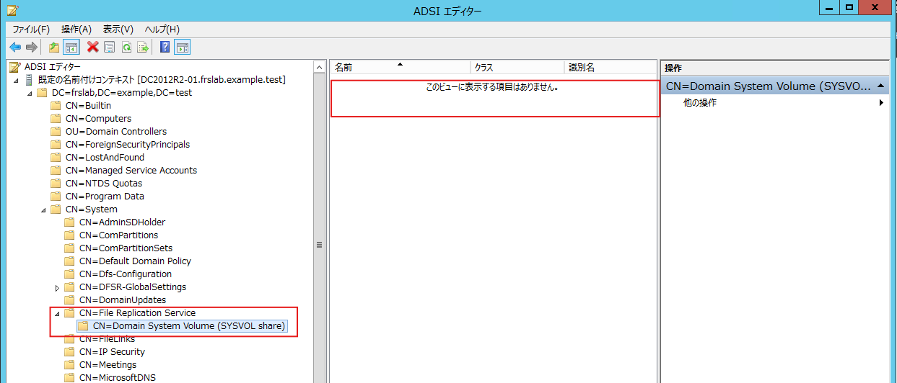

### まとめ

機能レベルを引き上げ、SYSVOLをFRSからDFSRへ移行した。移行では、コマンドの実行よりも前後の正常性確認が重要である。