# Active Directory：廃止済みDCの残存情報と不要サイトの削除を検証する

## 概要

本記事では、廃止済みのドメインコントローラー（DC）の情報がActive Directory上に残っている状態を再現し、残存情報と不要なADサイトを削除する手順を検証する。

Windows Server 2008で構築したドメインにWindows Server 2012 R2のDCを2台追加し、旧DCを正常に降格せず停止することで、廃止済みDCが登録されたままの状態を再現する。削除後は、残ったDC間のレプリケーションと登録情報を確認する。

## 検証の背景

Active Directoryの移行や運用を学ぶ中で、正常に降格できなくなったドメインコントローラーの残存情報を、どのように削除するのか確認したいと考えた。

そこで、ローカルの仮想環境に複数のDCとADサイトを構築し、不要DCを停止した状態から残存情報と不要サイトを削除する手順、および削除前後の確認事項を検証した。

## ドメイン構成

検証環境は、1つのドメインと2つのADサイトで構成する。MAIN-SITEにはWindows Server 2012 R2のDCを2台配置し、FSMOの全5役割をDC2012R2-01に集約する。OLD-SITEのDC2008は降格せずに停止し、AD上に残ったDC情報と不要サイトを削除する。

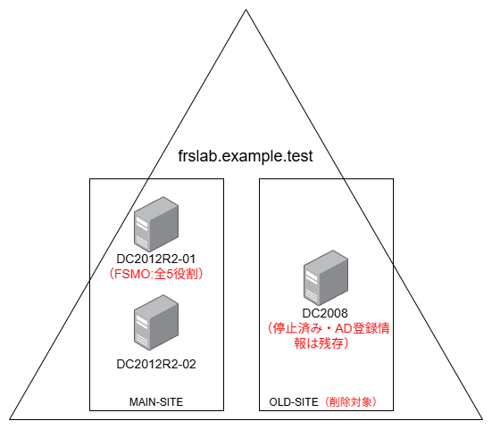

## 作業前の状態確認

DC2008を停止した状態で以下を確認する。コマンドとGUI操作は原則としてDC2012R2-01で実施し、net share と ipconfig /all はDC2012R2-02でも実施する。

※DC2008の停止直後は、前回の複製成功結果が表示される場合があるため、次の複製試行後に失敗を確認すること

| 確認項目 | コマンド・確認方法 | 期待する結果 |
| --- | --- | --- |
| FSMOの保持先 | `netdom query fsmo` | 全5役割が `DC2012R2-01.frslab.example.test` |
| 登録されているDCとサイト | `Get-ADDomainController -Filter * | Select Name,Site` | DC2008がOLD-SITE、DC2012R2-01／02がMAIN-SITEに登録されている |
| 1号機の受信レプリケーション | `repadmin /showrepl DC2012R2-01` | DC2012R2-02からの各領域の最終複製試行は成功し、停止中のDC2008からの最終複製試行は失敗している |
| 2号機の受信レプリケーション | `repadmin /showrepl DC2012R2-02` | DC2012R2-01からの各領域の最終複製試行が成功している |
| SYSVOL・NETLOGON共有 | `net share` | 2012R2の両DCにSYSVOL・NETLOGON共有が存在する |
| DNS参照先 | `ipconfig /all` | 2012R2の両DCが、継続利用するDNSを参照できる設定であり、DC2008だけに依存していない |
| 削除対象サイト | `dssite.msc` → OLD-SITE → Servers | DC2008だけが存在する |
| 削除対象サイトのサブネット関連付け | `dssite.msc` → Subnets → 各サブネットのプロパティ | （オプション）検証用サブネットがOLD-SITEに関連付いていること。削除前のサブネット名と関連付け先を記録する。 |

## 作業の流れ

Microsoft公式のDCメタデータのクリーンアップ手順（[https://learn.microsoft.com/en-us/windows-server/identity/ad-ds/deploy/ad-ds-metadata-cleanup](https://learn.microsoft.com/en-us/windows-server/identity/ad-ds/deploy/ad-ds-metadata-cleanup)）を参考に以下の流れで進める。

### Step 1.廃止済みDC（DC2008）の残存情報削除

DC2012R2-01で次のコマンドを実行し、停止済みのDC2008がAD上に登録されていることを確認する。

```powershell
Get-ADDomainController -Filter * |　Select-Object Name, Site, IsGlobalCatalog

結果
Name                          Site                            IsGlobalCatalog
----                          ----                            ---------------
DC2008                        OLD-SITE                                   True
DC2012R2-01                   MAIN-SITE                                  True
DC2012R2-02                   MAIN-SITE                                  True
```

DC2012R2-01の受信レプリケーションを確認する。停止済みのDC2008が複製元として残り、一部のパーティションで複製失敗が記録されていることを確認する。
※DNSパーティションには停止前の成功結果が残っているが、このまま時間が経てば失敗するはずなので失敗を待たずに検証を進める

```powershell
repadmin /showrepl DC2012R2-01

結果
MAIN-SITE\DC2012R2-01
DSA オプション: IS_GC
サイト オプション: (none)
DSA オブジェクト GUID: c558f961-692a-49f1-827f-bf4f9634bc5c
DSA 起動 ID: 8ec83671-519f-4f78-86e4-67014b333865

==== 入力方向の近隣サーバー======================================

DC=frslab,DC=example,DC=test
    OLD-SITE\DC2008 (RPC 経由)
        DSA オブジェクト GUID: 8701b3ad-f994-4432-9f8d-b95fdc36e676
        2026-09-07 13:14:59 の最後の試行は、失敗しました。結果は 8524 (0x214c):
            DNS 参照エラーのため、DSA 操作を続行できません。
        1 回連続で失敗しました。
        最後に成功したのは 2026-09-07 12:00:23 です。
    MAIN-SITE\DC2012R2-02 (RPC 経由)
        DSA オブジェクト GUID: 52f07824-c34e-464a-a24a-27450d6144d8
       2026-09-07 14:14:43 の最後の試行は成功しました。

CN=Configuration,DC=frslab,DC=example,DC=test
    OLD-SITE\DC2008 (RPC 経由)
        DSA オブジェクト GUID: 8701b3ad-f994-4432-9f8d-b95fdc36e676
        2026-09-07 13:14:47 の最後の試行は、失敗しました。結果は 8524 (0x214c):
            DNS 参照エラーのため、DSA 操作を続行できません。
        1 回連続で失敗しました。
        最後に成功したのは 2026-09-07 12:00:23 です。
    MAIN-SITE\DC2012R2-02 (RPC 経由)
        DSA オブジェクト GUID: 52f07824-c34e-464a-a24a-27450d6144d8
       2026-09-07 13:58:48 の最後の試行は成功しました。

CN=Schema,CN=Configuration,DC=frslab,DC=example,DC=test
    OLD-SITE\DC2008 (RPC 経由)
        DSA オブジェクト GUID: 8701b3ad-f994-4432-9f8d-b95fdc36e676
        2026-09-07 13:14:53 の最後の試行は、失敗しました。結果は 8524 (0x214c):
            DNS 参照エラーのため、DSA 操作を続行できません。
        1 回連続で失敗しました。
        最後に成功したのは 2026-09-07 12:00:23 です。
    MAIN-SITE\DC2012R2-02 (RPC 経由)
        DSA オブジェクト GUID: 52f07824-c34e-464a-a24a-27450d6144d8
       2026-09-07 13:58:48 の最後の試行は成功しました。

DC=DomainDnsZones,DC=frslab,DC=example,DC=test
    OLD-SITE\DC2008 (RPC 経由)
        DSA オブジェクト GUID: 8701b3ad-f994-4432-9f8d-b95fdc36e676
       2026-09-07 12:00:23 の最後の試行は成功しました。
    MAIN-SITE\DC2012R2-02 (RPC 経由)
        DSA オブジェクト GUID: 52f07824-c34e-464a-a24a-27450d6144d8
       2026-09-07 14:16:13 の最後の試行は成功しました。

DC=ForestDnsZones,DC=frslab,DC=example,DC=test
    OLD-SITE\DC2008 (RPC 経由)
        DSA オブジェクト GUID: 8701b3ad-f994-4432-9f8d-b95fdc36e676
       2026-09-07 12:00:23 の最後の試行は成功しました。
    MAIN-SITE\DC2012R2-02 (RPC 経由)
        DSA オブジェクト GUID: 52f07824-c34e-464a-a24a-27450d6144d8
       2026-09-07 13:58:48 の最後の試行は成功しました。

ソース: OLD-SITE\DC2008
******* 2026-09-07 12:00:23 以降 1 回の連続のエラー
最後のエラー: 8524 (0x214c):
            DNS 参照エラーのため、DSA 操作を続行できません。

```

［サーバー マネージャー］-［ツール］-［Active Directory サイトとサービス］を開き、接続先がDC2012R2-01であることを確認する。

［Sites］→［OLD-SITE］→［Servers］→［DC2008］を展開し、［NTDS Settings］を右クリックして［削除］を選択する。

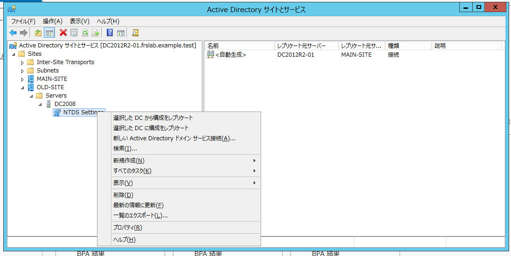

[はい]を選択

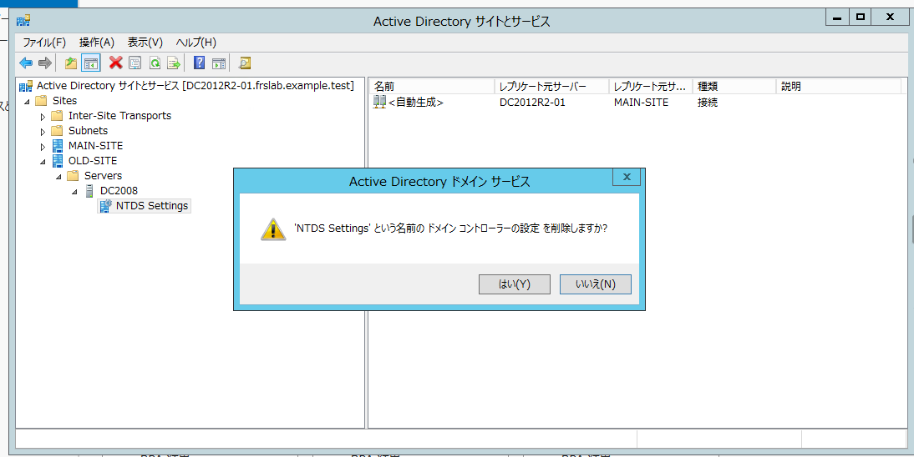

［完全にオフラインで、削除ウィザードを使用して削除できないこのドメイン コントローラーを削除する］にチェックを入れ、［削除］をクリックする。

通常は削除対象のDC自身で降格処理を実施する。今回は、廃止済みで降格できないDCを想定しているため、DC2008を停止した状態で残存情報の削除を行う。

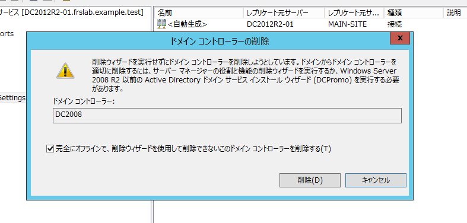

削除対象のDC2008がグローバルカタログであるため、確認画面が表示される。事前確認で、継続利用するDC2012R2-01／02もグローバルカタログであることを確認しているため、［はい］をクリックする。

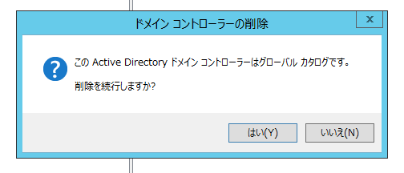

NTDS Settingsが削除され、DC2008配下に子オブジェクトが残っていないことを確認する。続いてDC2008を右クリックし、［削除］を選択する。

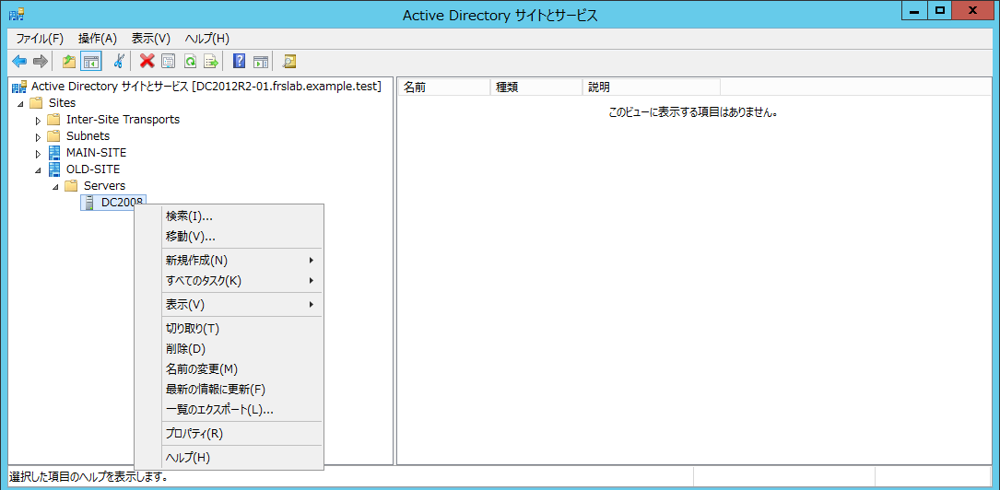

[はい]を選択

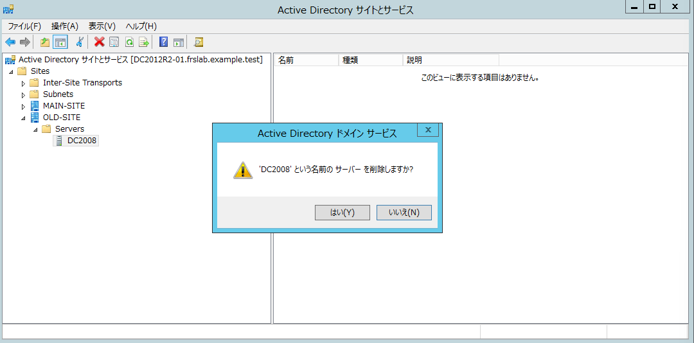

[DC2008]が消えたことを確認して、[OLD-SITE]を削除する。

### Step 2. 不要サイトと関連情報の整理

次に不要になった[OLD-SITE]を削除する。[OLD-SITE]を右クリック →［削除］を選択

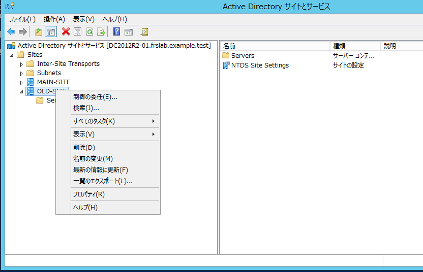

[はい]を選択

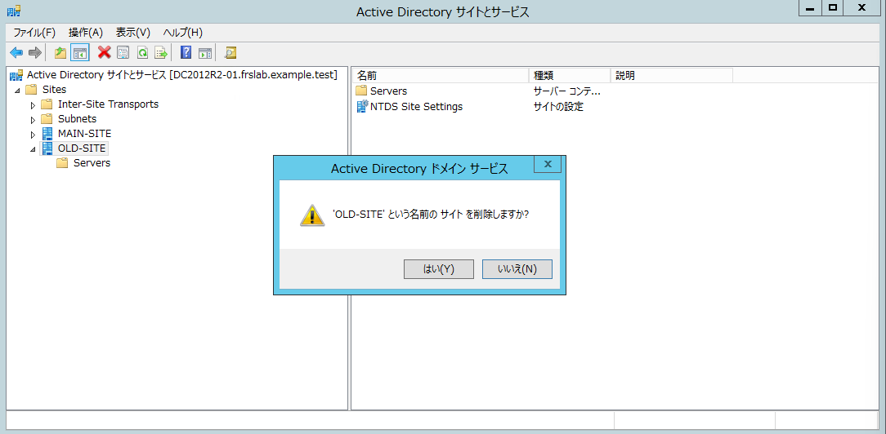

OLD-SITEには標準オブジェクトであるServersコンテナーとNTDS Site Settingsが残っているため、子オブジェクトを含む削除の確認画面が表示される。［サブツリーの削除］にチェックを入れずに、［はい］をクリックしてOLD-SITEを削除する。

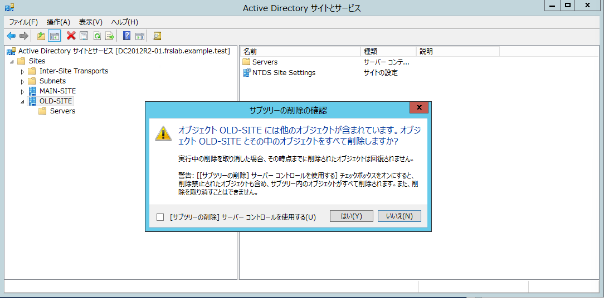

OLD-SITEが削除されたことを確認する。

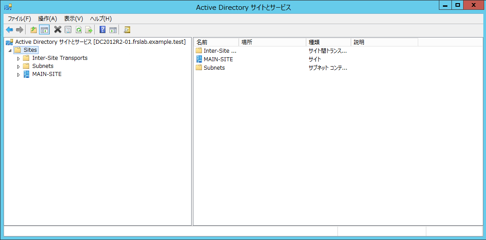

続いて、OLD-SITEに関連付けていたサブネットの状態を確認する。サイトの削除後もサブネットオブジェクト自体は残るが、関連付け先のサイトは空欄となった。MAIN-SITEへ自動的に再割り当てされないため、継続利用するサブネットについては、適切なサイトへ手動で関連付ける必要がある。

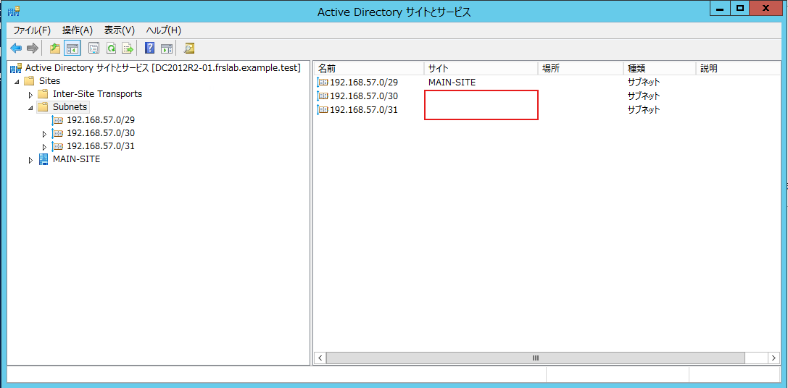

### Step 3.削除後の確認

削除操作が各DCへ反映され、残ったDC間でActive Directoryが正常に動作していることを確認する。以降のコマンドは、特記がない限りDC2012R2-01で実行する。確認対象のDCは、各コマンドの-Serverオプションまたはサーバー名で明示する。

DC2012R2-01とDC2012R2-02が保持するAD情報をそれぞれ参照し、DC2008がDC一覧から削除されていることを確認する。

```powershell
Get-ADDomainController -Filter * -Server DC2012R2-01 | Select-Object Name, Site, IsGlobalCatalog

期待結果：
Name                    Site                    IsGlobalCatalog
----                    ----                    ---------------
DC2012R2-01             MAIN-SITE                          True
DC2012R2-02             MAIN-SITE                          True

以下のコマンドでも上記と同じ結果になることを確認
Get-ADDomainController -Filter * -Server DC2012R2-02 | Select-Object Name, Site, IsGlobalCatalog
```

次にADサイトの一覧にMAIN-SITEだけが表示され、OLD-SITEが削除されていることを確認する。

```powershell
Get-ADReplicationSite -Filter * -Server DC2012R2-01 | Select-Object Name

期待結果：
Name
----
MAIN-SITE

以下のコマンドでも上記と同じ結果になることを確認
Get-ADReplicationSite -Filter * -Server DC2012R2-02 | Select-Object Name
```

各DCの受信レプリケーションを確認する。DC2008が入力方向の近隣サーバーから消え、DC2012R2-01／02間の各ディレクトリパーティションの最終複製試行が成功していることを確認する。

```powershell
repadmin /showrepl DC2012R2-01

期待結果：
MAIN-SITE\DC2012R2-01
DSA オプション: IS_GC
サイト オプション: (none)
DSA オブジェクト GUID: c558f961-692a-49f1-827f-bf4f9634bc5c
DSA 起動 ID: 8ec83671-519f-4f78-86e4-67014b333865

==== 入力方向の近隣サーバー======================================

DC=frslab,DC=example,DC=test
    MAIN-SITE\DC2012R2-02 (RPC 経由)
        DSA オブジェクト GUID: 52f07824-c34e-464a-a24a-27450d6144d8
       2026-09-07 18:58:48 の最後の試行は成功しました。

CN=Configuration,DC=frslab,DC=example,DC=test
    MAIN-SITE\DC2012R2-02 (RPC 経由)
        DSA オブジェクト GUID: 52f07824-c34e-464a-a24a-27450d6144d8
       2026-09-07 18:58:48 の最後の試行は成功しました。

CN=Schema,CN=Configuration,DC=frslab,DC=example,DC=test
    MAIN-SITE\DC2012R2-02 (RPC 経由)
        DSA オブジェクト GUID: 52f07824-c34e-464a-a24a-27450d6144d8
       2026-09-07 18:58:48 の最後の試行は成功しました。

DC=DomainDnsZones,DC=frslab,DC=example,DC=test
    MAIN-SITE\DC2012R2-02 (RPC 経由)
        DSA オブジェクト GUID: 52f07824-c34e-464a-a24a-27450d6144d8
       2026-09-07 18:58:48 の最後の試行は成功しました。

DC=ForestDnsZones,DC=frslab,DC=example,DC=test
    MAIN-SITE\DC2012R2-02 (RPC 経由)
        DSA オブジェクト GUID: 52f07824-c34e-464a-a24a-27450d6144d8
       2026-09-07 18:58:48 の最後の試行は成功しました。

以下のコマンドでも同様に確認する
repadmin /showrepl DC2012R2-02
```

続いて、レプリケーション全体の状態を確認する。ソースと宛先にDC2012R2-01／02だけが表示され、失敗数が0であることを確認する。

```powershell
repadmin /replsummary

期待結果：
レプリケーションの要約開始時刻: 2026-09-07 19:29:35

レプリケーションの要約のためのデータ収集を開始します。
これにはしばらく時間がかかる場合があります:
  .....

ソース DSA          最大デルタ    失敗/合計 %%   エラー
 DC2012R2-01               30m:33s    0 /   5    0
 DC2012R2-02               30m:47s    0 /   5    0

宛先 DSA     最大デルタ    失敗/合計 %%   エラー
 DC2012R2-01               30m:47s    0 /   5    0
 DC2012R2-02               30m:33s    0 /   5    0
```

FSMOの全5役割を、引き続きDC2012R2-01が保持していることを確認する。

```powershell
netdom query fsmo

期待結果：
スキーマ マスター                DC2012R2-01.frslab.example.test
ドメイン名前付けマスター        DC2012R2-01.frslab.example.test
PDC                         DC2012R2-01.frslab.example.test
RID プール マネージャー        DC2012R2-01.frslab.example.test
インフラストラクチャ マスター    DC2012R2-01.frslab.example.test
コマンドは正しく完了しました。
```

DC2008のコンピューターアカウントが存在しないことを確認する。なにも表示されなければ
OK

```powershell
Get-ADComputer -Filter 'Name -eq "DC2008"' -Server DC2012R2-01
Get-ADComputer -Filter 'Name -eq "DC2008"' -Server DC2012R2-02
```

DC2008のDNSレコードが存在しないことを確認する。どちらも「DNS名が存在しない」旨のエラーになればOK

```powershell
Resolve-DnsName DC2008.frslab.example.test -Type A -Server 192.168.57.51
Resolve-DnsName DC2008.frslab.example.test -Type A -Server 192.168.57.52
```

DC検出用SRVレコードも確認する。

```powershell
Resolve-DnsName _ldap._tcp.dc._msdcs.frslab.example.test -Type SRV -Server 192.168.57.51 |  Select-Object NameTarget, Port

実行結果:
NameTarget                                       Port
----------                                       ----
dc2012r2-02.frslab.example.test                   389
dc2012r2-01.frslab.example.test                   389

```

サブネットについては今後も利用するサブネットはMAIN-SITEへ関連付ける

### （オプション）サブネットの関連付けを整理

OLD-SITEを削除しても、関連付けられていたサブネットオブジェクト自体は削除されない。一方、サイトの関連付けは解除され、サイト欄が空欄になった。

サブネットが別のサイトへ自動的に関連付けられることはないため、今後も利用するサブネットはMAIN-SITEへ手動で関連付ける。検証用など、今後利用しないサブネットについては削除する。

### まとめ

正常に降格できないDC2008のメタデータと不要なOLD-SITEを削除し、関連するDNSレコードとサブネットを整理した。

削除後は、DC2012R2-01／02間のレプリケーションが正常であり、FSMOを含むActive Directoryの構成に問題がないことを確認できた。